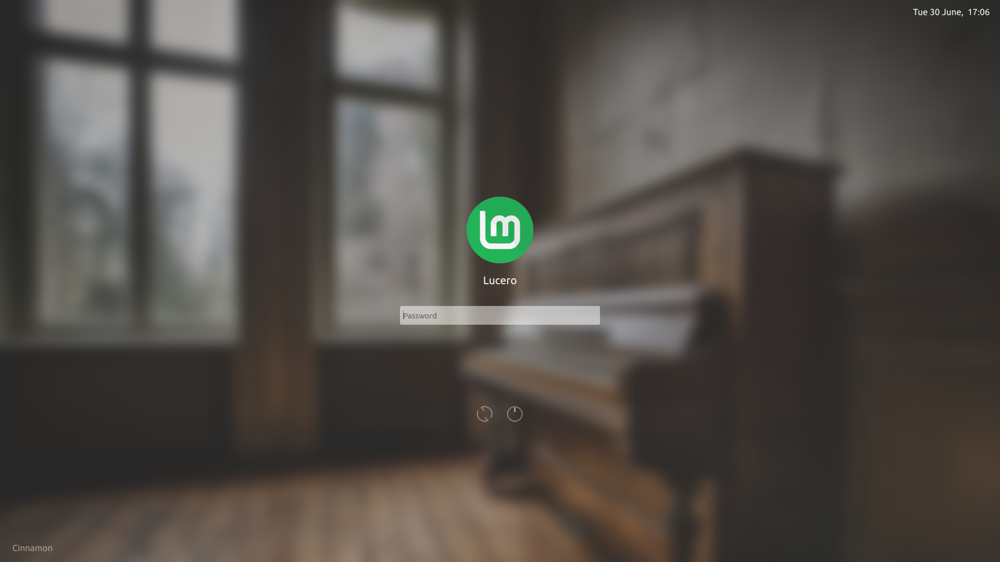

# Chili login theme for SDDM

Chili reduces all the clutter and leaves you with a clean, easy to use, login interface with a modern yet classy touch.

Chili for SDDM is the desktop environment *independent* adaption of MarianArlt's chili login theme for [KDE Plasma](https://www.kde.org/plasma-desktop) with *reduced functionality*. If you use Plasma as your desktop environment you would likely prefer [Chili for KDE Plasma](https://github.com/MarianArlt/kde-plasma-chili). 

## Dependencies (Ubuntu-based distros)
```zsh
sudo apt-get install sddm
sudo apt-get install qml-module-qtquick-layouts
sudo apt-get install qml-module-qtquick-controls
```

## Installing the theme

[Download the zip file](https://github.com/lu0/sddm-chili/archive/master.zip) and extract the contents to the theme directory of SDDM *(change the path for the downloaded file if necessary)*:
```zsh
sudo unzip ~/Downloads/sddm-chili-master.zip -d /usr/share/sddm/themes/
sudo mv /usr/share/sddm/themes/sddm-chili-master /usr/share/sddm/themes/sddm-chili
```
This will extract all the files to a folder called chili inside of the themes directory of SDDM. After that you will have to point SDDM to the new theme by editing its config file:
```zsh
sudo sh -c 'echo "[Theme]\nCurrent=sddm-chili" > /etc/sddm.conf' 
```
For a more detailed description for other distros please refer to the [Arch wiki on sddm](https://wiki.archlinux.org/index.php/SDDM).

## Theming the theme

Chili is highly customizable through its included `theme.conf` file. You can alter the intensity of the background blur and even not have any blur at all. If you have a very big screen and the fonts have a weird size then fix it yourself in the config file. You can even change the avatar size to something that better suits you. 

  * Change the path of the background image relative to the theme directory:
  `background=assets/wallpaper.jpg`

  * Adjust the screen dimensions if Chili looks weird, according to your max display resolution:
  `ScreenWidth=1366`
  `ScreenHeight=738`

  * Disable blur or play around with its intensity:
  `blur=true`
  `recursiveBlurLoops=4`
  `recursiveBlurRadius=15`

  * (De-)Activate a new outline-only effect for the password field:
  `PasswordFieldOutlined=false`

  * Adjust the font size of the whole theme in one go:
  *(Usually somewhere between 10 and 16, be careful)*
  `changeFontPointSize=`

  * Adjust the size of the avatar image:
  `changeAvatarPixelSize=`

You might see some grey pixels around your avatar image which is caused by the anti-aliasing of the opacity mask. You may change the fill color of the mask which resides in `assets/mask.svg` to a color that better matches with your avatar colors. Do **not** change the *opacity* of the mask! Take note that this might affect other avatar images with different colors present on your system.

## Acknowledgments
Forked from [MarianArlt/sddm-chili](https://github.com/MarianArlt/sddm-chili) to suit my preferences. I just changed the date format, removed the text under the buttons, hid the suspend button, changed the resolution, added my own wallpaper and updated the README with instructions for Ubuntu based distros.

### License
MarianArlt's project is licensed under the GPLv3 License - see the [LICENSE](LICENSE.md) for details
